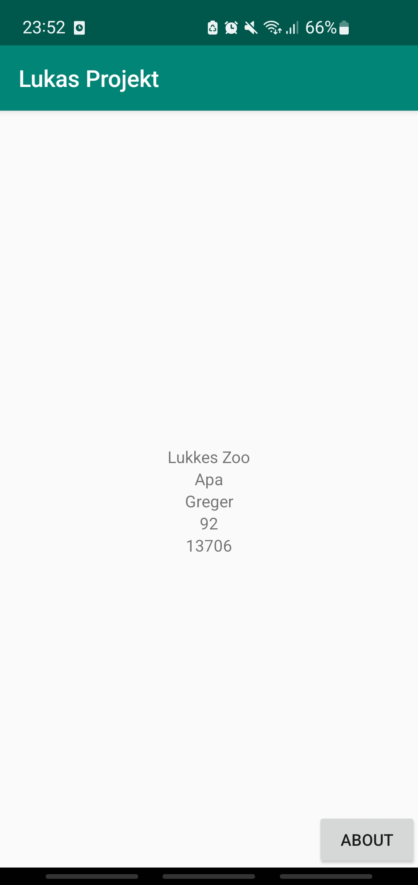
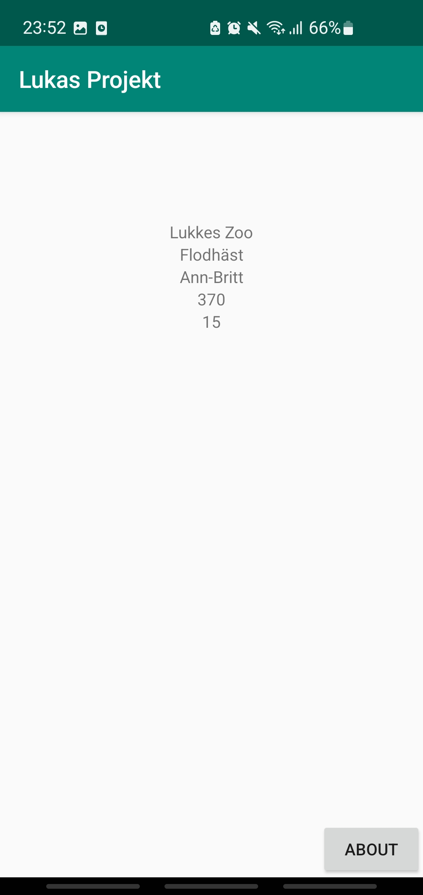
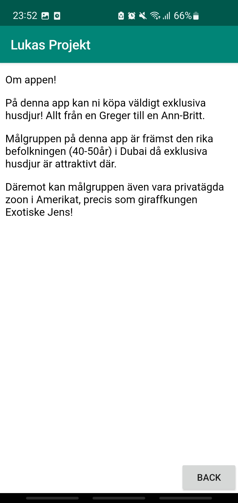

# Rapport
För att lösa uppgiften tacklade jag den svåraste utmaningen först vilket var att göra en recycler view. För att denna ska fungera behövs tre komponenter utöver själva recycler viewen. Dessa tre komponenter är en adapter, viewholder samt en javaklass som innehåller getters och setters för alla TextView element. Viewholdern är ett javascript som ska innehålla en TextView för varje enskilt objekt med data. Lösningen för min viewholder var att skapa en variabel för varje TextView som ska visas och därefter länka denna variabel med rätt TextView. Detta gjordes genom att använda findViewById.
```
public TextView id;
id = itemView.findViewById(R.id.id);
```
Därefter skapades javaklassen som ska innehålla alla getters och setters. Det som gjordes först var att skapa en variabel för varje enskilt element. Sedan är Android Studio rätt smidigt då det finns en funktion som automatiskt skapar getters och setters. Denna funktion användes för att få ut resterande kod i javaklassen.
```
private String ID;

public JsonData(String id, String company, String name, int size, int cost){
	this.ID = id;
}

public String getID() {
	return ID;
}

public void setID(String id) {
	this.ID = id;
}
```

När detta var klart behövdes adaptern fixas. Adaptern används för att få in rätt data i rätt TextView. För att lösa detta används i förstahand en LayoutInflater som ligger i “onCreateViewHolder”. Sedan för att få datan på rätt plats hämtas elementets position från en tidigare skapad array med hjälp av ```holder.id.setText(JsonData.get(position).getID());```. För att detta ska fungera för resterande element byts “id” samt “getID” ut för respektive namn på de TextView som finns.
```
public class MyAdapter extends RecyclerView.Adapter<ViewHolder> {
    private List<JsonData> JsonData;
    public MyAdapter(ArrayList<JsonData> JsonData){
        this.JsonData = JsonData;
    }

    @NonNull
    @Override
    public ViewHolder onCreateViewHolder(@NonNull ViewGroup parent, int viewType){
        View view = LayoutInflater.from(parent.getContext()).inflate(R.layout.activity_second, parent, false);
        return new ViewHolder(view);
    }

    @Override
    public void onBindViewHolder(@NonNull ViewHolder holder, int position){
        holder.id.setText(JsonData.get(position).getID());
        holder.company.setText(JsonData.get(position).getCompany());
        holder.name.setText(JsonData.get(position).getName());
        holder.size.setText(String.valueOf(JsonData.get(position).getSize()));
        holder.cost.setText(String.valueOf(JsonData.get(position).getCost()));
    }

    @Override
    public int getItemCount(){
        return JsonData.size();
    }
}
```
Självklart behövs även en RecyclerView samt TextView för varje element. En RecyclerView skapades i “activity_main.xml” genom att dra den från design-vyn. Samma teknik användes för att skapa de fem TextView element som behövdes. Dessa skapades däremot i “activity_second.xml”. Constraints sattes på alla sex element och de positioneras även med hjälp av constraints.

När min RecyclerView var klar var det dags att tackla ett lite enklare problem. Detta problem var att det skulle finnas en andra aktivitet som innehåller information angående appen. Lösningen jag kom fram med var att skapa en html fil som länkas in i min andra aktivitet. Valet grundas på att jag är väldigt bekväm med att skriva just html kod. Det första som gjordes var att skapa en ny aktivitet. Inuti denna aktivitet gjordes två variabler. En variabel för min WebView samt en för min knapp. Dessa element la jag även till i min layout fil genom design-vyn. Även här användes findViewById för att länka rätt variabel till rätt element. Sedan sattes en onClickListener på knappen. I denna onClickListener används funktionen “finish()” för att avsluta min andra aktivitet så att aktiviteterna inte staplas på varandra. I min första aktivitet skapades även en knapp för att komma till den andra aktivitet med information om appen. Denna knappen skapades på liknande sätt, däremot annan kod i min onClickListener. I denna användes en Intent istället för att skicka användaren till nästa aktivitet. I början av denna onClickListener skapas min Intent och i slutet kallas själva funktionen.
```
public void onClick(View view) {
	Intent intent = new Intent(MainActivity.this, WebViewActivity.class);
	startActivity(intent);
}
```
Slutligen var det sista jag gjorde att implementera hemsidan i min WebView. Detta gjorde jag genom att skapa en ny void funktion. Inuti denna funktion används “loadUrl”. Då det var en intern hemsida jag använder mig av så hämtar jag min url från filens plats i mappen. Sist kallar jag på funktionen i min onCreate för att visa hemsidan.

```
showInternalWebPage();
}

public void showInternalWebPage(){
	webView.loadUrl("file:///android_asset/webpage.html");
}
```






